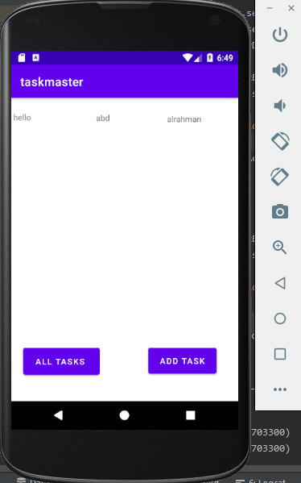

# taskmaster

Layering Layers On Home Page (Text and Buttons)
 * Create a Task class. A Task should have a title, a body, and a state. The state should be one of “new”, “assigned”, “in progress”, or “complete”.

 * Refactor your homepage to use a RecyclerView for displaying Task data. This should have hardcoded Task data for now.
 
 * Create a ViewAdapter class that displays data from a list of Tasks
 * 
 * create three  Task instances and use those to populate your RecyclerView/ViewAdapter. 

 

 

